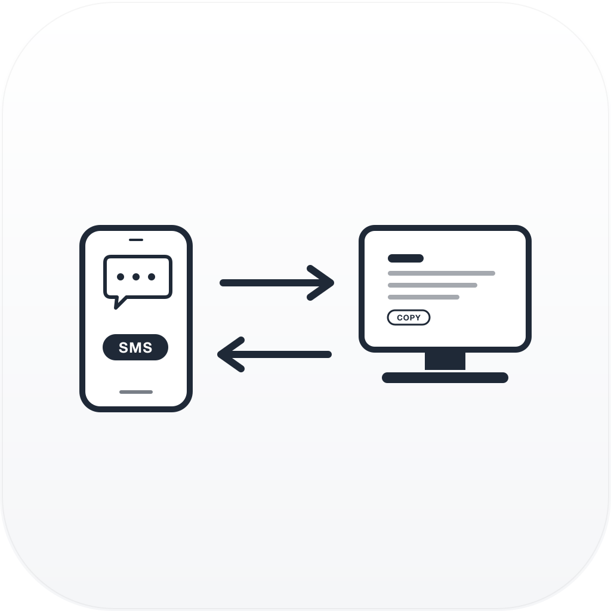

<p align="center">
  
</p>

# ClipSync-Android

Android 客户端：监听短信验证码 + 分享菜单推送剪贴板/图片 → 上传到 ClipSync-Server。

---

## 一、准备环境（一次性）

### 1. 装 Android Studio

下载：https://developer.android.com/studio

装好后首次打开会引导安装 Android SDK（选 API 34 就行）。

### 2. 设置环境变量（命令行打包才需要）

在你的 `~/.zshrc` 或 `~/.bash_profile` 里加：

```bash
export ANDROID_HOME=$HOME/Library/Android/sdk
export PATH=$PATH:$ANDROID_HOME/platform-tools:$ANDROID_HOME/emulator
```

然后 `source ~/.zshrc` 生效。

### 3. 手机开启 USB 调试

- 系统设置 → 关于本机 → **连点「版本号」7 次** 打开开发者模式
- 开发者选项 → 打开 **USB 调试**
- 用数据线连电脑，选「文件传输」模式

---

## 二、运行（推荐用 Android Studio）

1. 打开 Android Studio
2. **Open** → 选择本目录 `ClipSync-Android/`
3. 等待 Gradle Sync 完成（首次会下依赖，可能要几分钟）
4. 顶部选中你的设备（真机或模拟器）
5. 点绿色 ▶️ 或 **Shift+F10** 运行

首次运行需要手动授予**短信权限**和**通知权限**：
- 系统设置 → 应用 → ClipSync → 权限 → 全部允许

---

## 三、命令行打包（打 APK 用）

在项目根目录（`ClipSync-Android/`）：

### Debug APK（不用签名，自用最方便）

```bash
./gradlew assembleDebug
```

生成的 APK 位置：

```
app/build/outputs/apk/debug/app-debug.apk
```

直接把这个文件拷到手机，点开安装即可。

### Release APK（需要签名，正式分发用）

第 1 步：生成签名 keystore（一次性）

```bash
keytool -genkey -v -keystore clipsync.keystore \
        -keyalg RSA -keysize 2048 -validity 10000 \
        -alias clipsync
```

按提示填口令、姓名等。

第 2 步：修改 `app/build.gradle.kts`，在 `android { }` 里加：

```kotlin
signingConfigs {
    create("release") {
        storeFile = file("../clipsync.keystore")
        storePassword = "你的口令"
        keyAlias = "clipsync"
        keyPassword = "你的口令"
    }
}
buildTypes {
    release {
        signingConfig = signingConfigs.getByName("release")
        isMinifyEnabled = false
    }
}
```

第 3 步：打 release 包

```bash
./gradlew assembleRelease
```

产物在 `app/build/outputs/apk/release/app-release.apk`。

---

## 四、直接把 APK 装到已连接的手机

```bash
./gradlew installDebug
# 或者用 adb 手动装
adb install app/build/outputs/apk/debug/app-debug.apk
```

---

## 五、首次没有 gradlew 怎么办？

用 Android Studio 打开项目一次即可（会自动生成 `gradlew` 和 `gradle/wrapper/` 目录）。或者手动执行：

```bash
gradle wrapper --gradle-version 8.7
```

前提本地已装 Gradle。

---

## 六、使用说明

1. 打开 App → 填服务器地址（如 `ws://192.168.11.234:8080`）和 Token
2. 点「启动同步服务」→ 通知栏出现常驻通知说明后台在跑
3. **验证码**：自动监听短信里 4-8 位数字，识别后推送
4. **手动分享**：任意 App 里长按选中文字 / 图片 → 分享 → 选 **ClipSync**

---

## 七、常见问题

| 问题 | 解决 |
|------|------|
| 收不到验证码 | 系统设置授予短信权限；关闭对该 App 的电池优化 |
| 后台被杀 | 系统设置里锁定该 App 或加白名单 |
| 连不上服务端 | 检查服务器地址和 token；手机和电脑同一 WiFi；防火墙放行 8080 |
| 分享菜单没有 ClipSync | 重启系统或重装 App |
